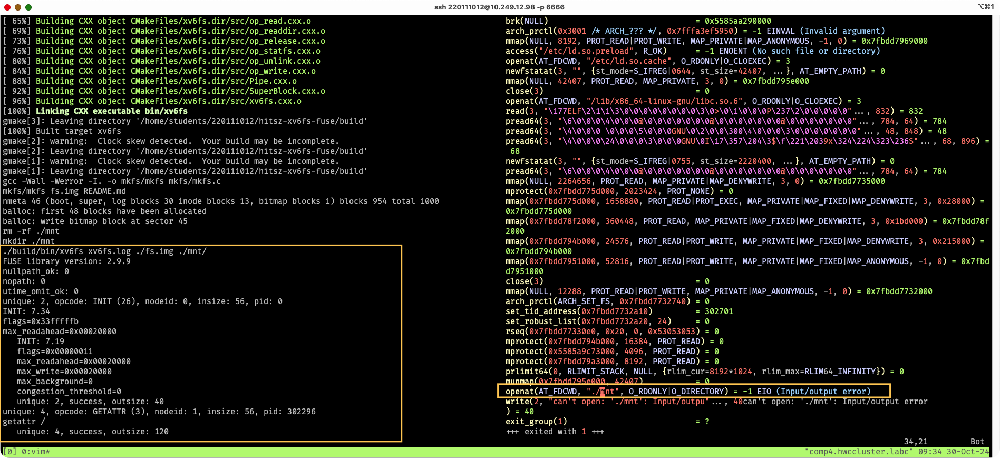

# README

# 实验详细设计

## 总体设计方案

我的设计与 xv6 的设计是一致的, 将 xv6 移植到了 fuse 上, 当然 xv6 是用 C 的, C 语言字符串处理、路径处理比较难受, 但是用 C++就会好许多。架构上与 xv6 一致, 实现细节上与 xv6 不同, 本来我就是为了能读写 xv6 的 fs.img .

- 我的 Disk 读写是: 打开文件句柄, 将 fs 通过 mmap 映射到一个内存中.
- BlockCache（也就是上图的 Buffer Cache）是块缓存, 将 disk 的 block 缓存在内存中
- Logging 是日志系统, 提供了 3 个 api: begin_op, log_write, end_op。写文件的基本步骤是: begin_op() -> writing sth. -> log_write() -> end_op()
- INode 是索引节点, 我这里也做了索引节点的缓存, 区分 DiskINode（磁盘上的 INode）, 内存中的 INode

日志系统的设计方案与 xv6 一致. 用到了两个 Cache : INodeCache, BlockCache.

BlockCache 对所有的 disk block 是一视同仁的, 不会区分是否为: Log Block, Data Block, INode Block.

下面是 DiskINode 的结构, 采用直接索引、一级间接索引

## 功能详细说明

详细说明每个功能点有些麻烦了. 我这里就详细描述一下日志系统的实现吧.

### 日志系统

下面是日志系统过程的详解

- begin_op: 如果 committing 或者 log_list (mem) 满了的话, 那么就会陷入等待. outstanding++ . log_list(mem) 与 log_head(disk) 应该是保持一致的.
- end_op: 如果没有 outstanding (未完成), 那么就开始 commit 操作.
- commit: 对文件系统的操作, 都会被 BlockCache 兜住. commit 的过程, 就是: 从 data_blk(mem) 写入 log_blk(disk) 的过程, 再从 log_blk(disk) 写入 data_blk(disk) 的过程.
- log_write: begin_op ~ end_op 中操作的 blk 会记录到 log_list(mem) 中, 同时增加引用计数, 因为要保证: “对 fs 的操作, 都会被 BlockCache 兜住", 防止 BlockCache 被释放导致的内存不安全的问题.

下面是: 静态的日志文件系统 (还没有做什么操作的情况下)

下面是: 发生了 begin_op, write sth. 时的格局图

下面是: 发生了 begin_op, write sth., log_write 时的格局图

下面是: 发生了 end_op 时, commit 的流程

## 实验特色

1. 实现了日志文件系统. 实现了大多数的钩子函数, 没实现软链接(我在 xv6 中做了软链接的实验, 在这里就懒得实现软链接了).
   - 设计思路: 与 xv6 一致
   - 实现方法: 抄, 但是不完全抄
   - 预期效果: 我尝试在 copy 一个文件的时候, kill 掉 xv6fs 进程. 最终可以看到文件并没有被复制.
2. 使用 google test 写了一些单元测试之类的, TODO, 还要补充完全单元测试.
3. 修改了 xv6 提供的 mkfs/mkfs.c 用于制作 fs.img

# 遇到的问题及解决方法

遇到的问题: 因为我并没有遵循实验指导书的步骤, 因为我看不懂 bash 脚本, 或者一看到几百行的 bash 脚本就没心思读下去.
于是乎, 我自己打了一套框架. 但是自己搭的框架确实会遇到一些问题: 我就在挂载的时候遇到了问题 : 我写了 1000 行左右的时候,
我想要观察现象, 所以我想要起一下我这个文件系统试试, 但是一直没有正确的挂载.
可以看到, 我这里并不能对挂载点进行任何的操作.

我一开始以为是我实现的问题. 我写了一个简单的 ls 程序, 并用 strace 观察了一下这个 ls 程序 open 挂载点的时候, 系统调用的情况. 我发现一件很惊人的事实: 左边 fuse 有调试信息输出: 确实用了 getattr, 但是右边 open 系统调用却返回 EIO. 我怀疑是没有正确的读取挂载点. 于是乎我用 sudo 运行这个 ls 程序, 就成功 open 了.

# 实验收获和建议

收获: 我自己下了许多猛料, 通过这一次实验, 我发现 xv6 的文件系统设计的并不好, Logging 与上层读写的耦合性太高,
我觉得我应该要参考更多的日志文件系统的代码. 当然啦, 通过本次实验, 我学习到了: 日志在文件系统中是会是一种怎么样的表现形式.

建议: bash 脚本太冗长, 可能换成 perl 会好一些.

# 参考资料

1. Writing a FUSE Filesystem: a Tutorial: https://www.cs.nmsu.edu/~pfeiffer/fuse-tutorial/
2. fuser rust: https://github.com/cberner/fuser/blob/master/examples/simple.rs
3. mit xv6: https://pdos.csail.mit.edu/6.828/2023/xv6.html
4. fuse ext2: https://github.com/alperakcan/fuse-ext2
5. 实验指导书 2024: https://os-labs.pages.dev/lab5/part1/
6. 文件系统内幕 (书)
7. google level db
